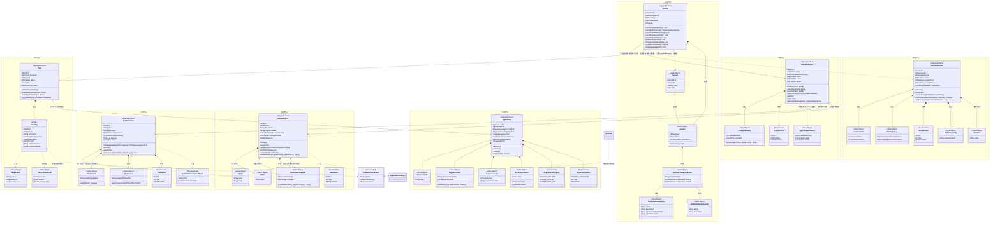

```mermaid
classDiagram
    namespace 计划聚合 {
        class Plan {
            <<Aggregate Root>>
            +PlanId id
            +SessionId sessionId
            +String goal
            +PlanStatus status
            +int version
            +List~PlanStep~ steps
            +getNextPendingStep()
            +markStepSuccess(stepId, result)
            +markStepFailed(stepId, reason)
            +applyReplan(List~PlanStep~ newSteps)
        }

        class PlanStep {
            <<Entity>>
            +StepId id
            +int sequence
            +String description
            +List~StepId~ dependsOn
            +StepStatus status
            +int retryCount
            +String lastErrorReason
            +String executionResult
        }

        class StepResult {
            <<Value Object>>
            +String output
            +long tokenCost
            +boolean isSuccess
        }

        class VerificationResult {
            <<Value Object>>
            +boolean passed
            +String reason
            +VerificationType type
        }
    }

    namespace 会话聚合 {
        class Session {
            <<Aggregate Root>>
            -SessionId id
            -SessionId parentId
            -Status status
            -Date createdDate
            -String title
            +recordUserInput(String) void
            +recordLlmResponse() ResponseWriteStream
            +recordToolRequest(String) void
            +recordToolResult(String) void
            +injectSkillDetail(String) void
            +buildContextForLlm() List
            +moveContextWindow(int) void
            +needSummarization() boolean
            +switchModel(ModelId) void
        }

        class Record {
            <<Value Object>>
            -RecordId id
            -String role
            -String content
            -Date date
        }

        class Context {
            <<Value Object>>
            -int maxToken
            -int usedToken
            -List~RecordId~ recordIdList
            -buildContext() List
        }

        class SystemPromptSnapshot {
            <<Value Object>>
            -String promptTemplate
            -List~ToolDefinitionSnapshot~ toolList
            -List~SkillDefinitionSnapshot~ skillList
        }

        class ToolSchemaSnapshot {
            <<Value Object>>
            -String name
            -String description
            -String parametersJsonSchema
            -String outputDescription
        }

        class SkillDefinitionSnapshot {
            <<Value Object>>
            -String name
            -String description
        }
    }

    namespace 代理聚合 {
        class AgentDefinition {
            <<Aggregate Root>>
            -AgentId id
            -AgentName name
            -PromptTemplate basePrompt
            -AgentStatus status
            -List~ToolId~ toolIds
            -List~SkillId~ skillIds
            +bindTool(ToolId toolId)
            +unbindTool(ToolId toolId)
            +bindSkill(SkillId skillId)
            +updatePrompt(PromptTemplate template)
            +publish() 
            +deprecate()
            +generateRawSnapshot() AgentSnapshotData
        }

        class PromptTemplate {
            <<Value Object>>
            -String templateText
            -List~String~ variables
            +render(Map~String, Object~ vars) String
        }

        class AgentSnapshotData {
            <<Value Object>>
            -String renderedPrompt
            -List~ToolId~ toolIds
            -List~SkillId~ skillIds
        }

        class AgentStatus {
            <<Enumeration>>
            DRAFT
            PUBLISHED
            DEPRECATED
        }
    }

    namespace 模型聚合 {
        class ModelDefinition {
            <<Aggregate Root>>
            -ModelId id
            -String provider
            -String apiEndpoint
            -ModelStatus status
            -ContextLimit contextLimit
            -PricingPolicy pricingPolicy
            -List~ModelCapability~ capabilities
            +activate()
            +deprecate()
            +updatePricing(PricingPolicy newPolicy)
            +hasCapability(ModelCapability capability) boolean
            +validateRequest(int estimatedTokens) void
        }

        class ContextLimit {
            <<Value Object>>
            -int maxInputTokens
            -int maxOutputTokens
        }

        class PricingPolicy {
            <<Value Object>>
            -BigDecimal inputPricePerKToken
            -BigDecimal outputPricePerKToken
        }

        class ModelCapability {
            <<Value Object>>
            -String capabilityName
        }

        class ModelId {
            <<Value Object>>
            -String value
        }

        class ModelStatus {
            <<Enumeration>>
            DRAFT
            ACTIVE
            DEPRECATED
        }
    }

    namespace 工具聚合 {
        class ToolDefinition {
            <<Aggregate Root>>
            -ToolId id
            -String name
            -String description
            -ToolSchema inputSchema
            -ToolSchema outputSchema
            -ToolSource source
            -ToolStatus status
            +updateMetadata(String newDesc, ToolSchema newSchema)
            +activate()
            +deactivate()
            +validateArgs(Map~String, Object~ args) void
        }

        class ToolSchema {
            <<Value Object>>
            -String jsonSchemaString
            +isValidJson() boolean
        }

        class ToolSource {
            <<Value Object>>
            -SourceType type (NATIVE, REST, MCP)
            -String endpointOrIdentifier
        }

        class ToolId {
            <<Value Object>>
            -String value
        }

        class ToolStatus {
            <<Enumeration>>
            DRAFT
            ACTIVE
            DEPRECATED
        }

        class ToolDefinitionUpdatedEvent {
            <<Domain Event>>
            -ToolId toolId
            -LocalDateTime updatedAt
        }
    }

    class ToolExecutionResult {
        <<Value Object>>
        -String content
        -boolean isTruncated
        -String resourceUri
    }

    namespace 技能聚合 {
        class SkillDefinition {
            <<Aggregate Root>>
            -SkillId id
            -String name
            -String description
            -String triggerCondition
            -InstructionTemplate sopTemplate
            -List~ToolId~ requiredToolIds
            -SkillStatus status
            +activate()
            +deprecate()
            +updateSop(InstructionTemplate newSop)
            +bindTool(ToolId toolId)
            +unbindTool(ToolId toolId)
            +renderDetailedSop(Map~String, Object~ vars) String
        }

        class InstructionTemplate {
            <<Value Object>>
            -String rawMarkdown
            -List~String~ variables
            +render(Map~String, Object~ context) String
        }

        class SkillId {
            <<Value Object>>
            -String value
        }

        class ToolId {
            <<Value Object>>
            -String value
        }

        class SkillStatus {
            <<Enumeration>>
            DRAFT
            ACTIVE
            DEPRECATED
        }
    }
    
    namespace 经验聚合 {
        class Experience {
            <<Aggregate Root>>
            -ExperienceId id
            -AgentId agentId
            -ExperienceCategory category
            -TriggerContext triggerContext
            -LessonLearned lesson
            -ConfidenceScore confidence
            -ExperienceStatus status
            -int appliedCount
            +reinforce()
            +penalize()
            +archive()
            +isApplicable() boolean
        }

        class TriggerContext {
            <<Value Object>>
            -String scenarioDescription
            -List~String~ keywords
            +matches(String inputContext) boolean
        }
        
        class LessonLearned {
            <<Value Object>>
            -String instruction
            -String expectedOutcome
        }

        class ConfidenceScore {
            <<Value Object>>
            -double value
            -double increase()
            -double decrease()
        }

        class ExperienceId {
            <<Value Object>>
            -String value
        }

        class ExperienceCategory {
            <<Enumeration>>
            SUCCESS_PATTERN
            FAILURE_LESSON
            OPTIMIZATION_HINT
        }

        class ExperienceStatus {
            <<Enumeration>>
            PENDING_VALIDATION
            ACTIVE
            ARCHIVED
        }
    }

    Plan "1" *-- "1..*" PlanStep : 组合
    PlanStep ..> StepResult : 产生
    PlanStep ..> VerificationResult : 被验证

    AgentDefinition *-- PromptTemplate : 组合
    AgentDefinition --> AgentStatus : 状态
    AgentDefinition ..> AgentSnapshotData : 产生 (供 Session 组装)

    AgentDefinition "1" --> "0..*" ToolDefinition : 关联多个工具
    AgentDefinition "1" --> "0..*" SkillDefinition : 关联多个技能

    Session --> Plan : 一个会话执行0到多个计划
    Session --> AgentDefinition : 获取系统提示词快照

    ModelDefinition *-- ContextLimit : 组合
    ModelDefinition *-- PricingPolicy : 组合
    ModelDefinition *-- ModelStatus : 状态
    ModelDefinition "1" *-- "0..*" ModelCapability : 组合
    ModelDefinition *-- ModelId : 唯一标识

    Session ..> ModelDefinition : 引用 (activeModelId)

    Session "1" --> "0..*" Record : 持有
    Session "1" *-- "1" Context : 持有
    Record "1" -- "0..*" Context : 组成
    Context "1" *-- "1" SystemPromptSnapshot : 持有
    SystemPromptSnapshot "1" -- "0..*" ToolSchemaSnapshot : 持有
    SystemPromptSnapshot "1" -- "0..*" SkillDefinitionSnapshot : 持有

    ToolDefinition *-- ToolId : 唯一标识
    ToolDefinition *-- ToolSchema : 组合 (入参/出参)
    ToolDefinition *-- ToolSource : 组合
    ToolDefinition *-- ToolStatus : 状态
    ToolDefinition ..> ToolDefinitionUpdatedEvent : 产生

    PlanStep ..> ToolExecutionResult : 依赖 (虚线箭头)
    Message ..> ToolExecutionResult : 依赖 (虚线箭头)

    SkillDefinition *-- SkillId : 唯一标识
    SkillDefinition *-- InstructionTemplate : 组合 (SOP)
    SkillDefinition *-- SkillStatus : 状态
    SkillDefinition "1" *-- "0..*" ToolId : 组合 (专属工具ID列表)
    SkillDefinition ..> SkillActivatedEvent : 产生

    Experience *-- ExperienceId
    Experience *-- TriggerContext
    Experience *-- LessonLearned
    Experience *-- ConfidenceScore
    Experience *-- ExperienceCategory
    Experience *-- ExperienceStatus

    Plan --> Experience : Reflexion沉淀经验
```